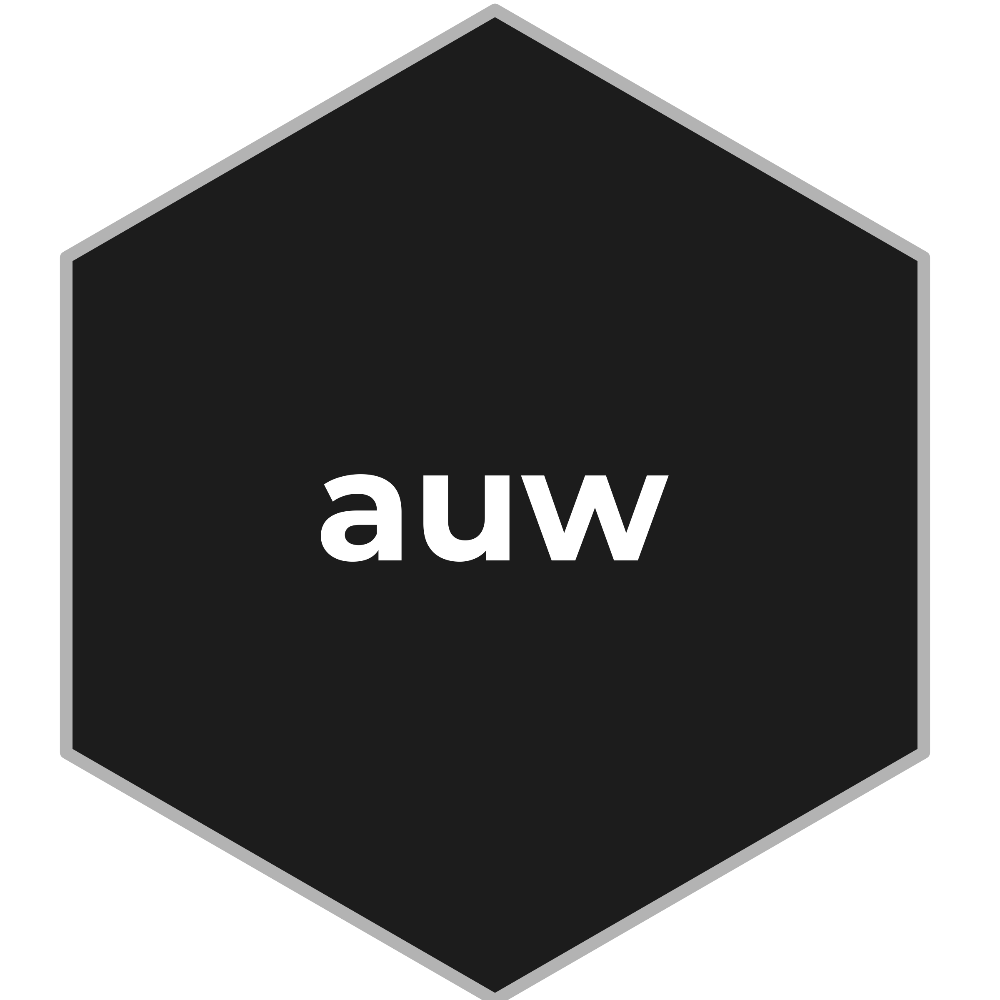
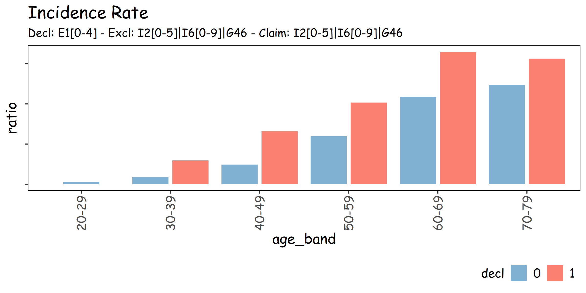
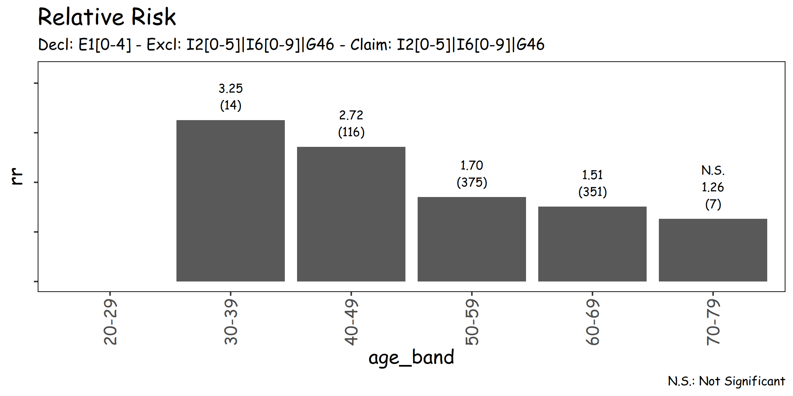

# auw



<!-- badges: start -->

[](https://CRAN.R-project.org/package=auw) [](https://github.com/seokhoonj/auw/actions/workflows/R-CMD-check.yaml)

<!-- badges: end -->

## Installation

``` r
# install dev version
devtools::install_github("seokhoonj/auw")
```

## Examples

``` r
library(auw)
library(ggshort)
library(instead)

# set_instead_font("Comic Sans MS")
# set_ggshort_font("Comic Sans MS")

cohort <- instead::read_rds("cohort.rds")
mix    <- instead::read_rds("mix.rds")

auw::add_age_band(cohort, age_var = age, interval = 10)

decl  <- list(-60,  0, "E1[0-4]")
excl  <- list(-60,  0, "I2[0-5]|I6[0-9]|G46")
claim <- list(  0, 36, "I2[0-5]|I6[0-9]|G46")

data <- auw::summarise_id_with_kcd_ir(
  cohort = cohort,
  id_var = id,
  group_var = .(age_band),
  kcd_var = kcd,
  from_var = sdate,
  to_var = edate,
  uw_date = as.Date("2017-08-01"),
  decl1 = decl,
  excl  = excl,
  claim = claim
)

ir <- summary(data)
rr <- auw::summarise_rr(ir)

plot(ir)
plot(rr)
```

 
